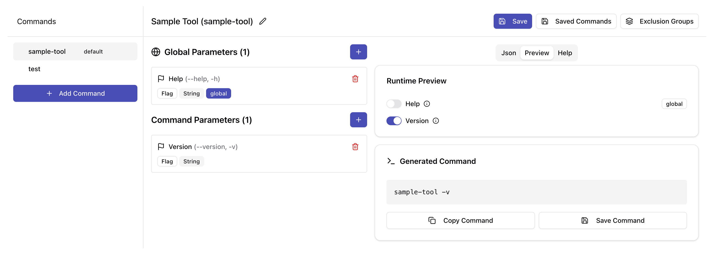
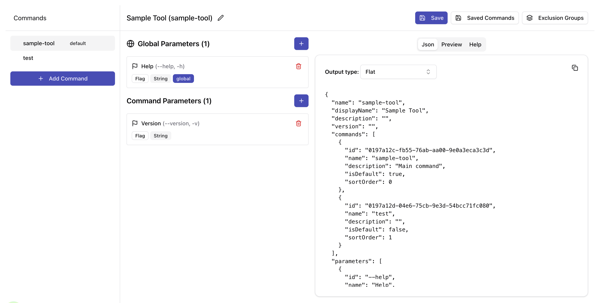

# Commandly

## Description

A user-friendly way to generate CLI commands using UI.

Main UI

Generated JSON

## Features

- Commands and Subcommands
- Parameters
- Runtime Preview
- Specify Dependencies and Validations
- JSON Output - Nested, Flat.
- Generate Help Menu
- Generate Command
- Saved Commands - using localstorage
- Exclusion Groups
- Json specification

## Todos

- Implement parsing help text into json structure using AI.
- Explore MCP server
- Test and Run commands from browser. Maybe using some container to securely run commands or locally using wasm.
- More tests
- Improve UI, validations.
- Shadcn Registry (maybe?)

## Motivation

When there are lots of commands and options in cli tools like [ffmpeg](https://github.com/FFmpeg/FFmpeg), I often find it it confusing and I'm lazy to figure it out all by myself (or just use ChatGPT).

We also know LLMs love structured inputs, what better than a clearly defined json specification with listing all commands and options that go into a cli tool.

And lastly, MCPs. Goal is to expose all these tools via mcp and llms would be able to get all the details of commands and options whenever and wherever required.

## Contributing

Development - Please read the [contributing guide](/CONTRIBUTING.md).

For adding new tools:

1. Create/Design tool locally
2. Copy **Flat** Json Output
3. Raise a PR, adding json file to public/tools-collection.

**Disclaimer**: Most of it is vibe-coded. 100% of the tests were written using vibe-coding and some of them are too basic. And I know there are bugs for sure, please file an issue. Contributions are Welcome.

## License

Licensed under the [MIT license](https://github.com/divyeshio/Commandly/blob/main/LICENSE.md).
