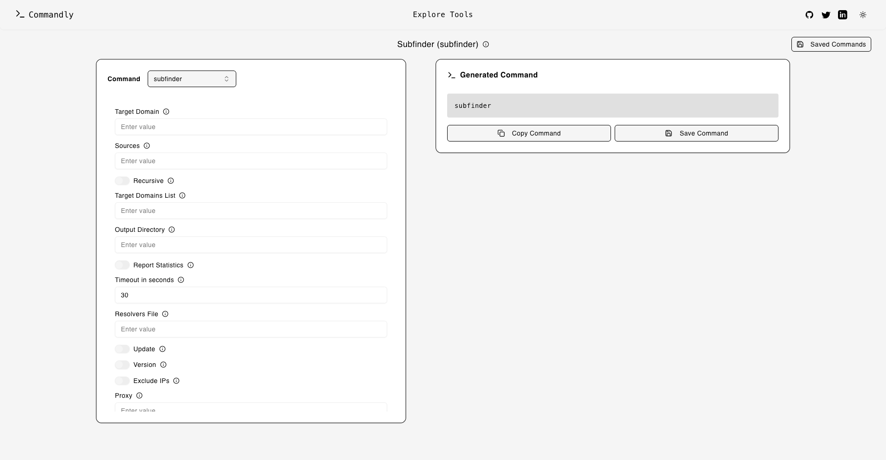
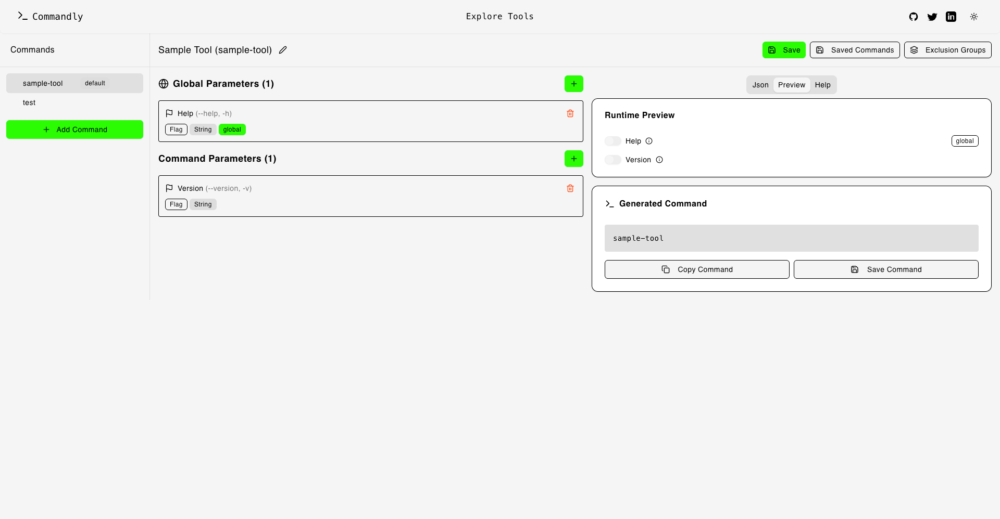

    <h1>Commandly</h1>
    

<h4 align="center">CLI -> UI. A user-friendly way to generate CLI commands using UI. Quickly turn help text from any CLI tool into UI using AI.</h4>
     

  <a href="#features">Features</a> •
  <a href="#contributing">Contribute</a> •
  <a href="https://buymeacoffee.com/divyeshio" target="_blank">Sponsor</a> •
  <a href="#license">License</a> •

## ✨ Features

<h1 align="center">
  
  
   
</h1>

- Commands and Subcommands
- Parameters
- Tool Renderer
- Specify Dependencies and Validations
- JSON Output - Nested, Flat.
- Generate Help Menu
- Generate Command
- Saved Commands - using localstorage
- Exclusion Groups
- JSON specification
- AI Generation - Quickly turn help text from any CLI tool into UI.

## 🎯 Motivation

Complex CLI tools with tons of commands and options can be overwhelming. Instead of wrestling with documentation or asking ChatGPT, why not just use a UI?

LLMs work best with structured data. Imagine having all your CLI commands and options neatly organized in a single JSON file.

Plus, building this to work with MCPs. Eventually, LLMs should be able to access all these tool details whenever they need them.

## 💪🏻 Contributing

Development - Please read the [contributing guide](/CONTRIBUTING.md).

For adding new tools:

1. Create/Design tool locally
2. Copy **Flat** JSON Output
3. Raise a PR, adding JSON file to public/tools-collection.

## 📜 License

Licensed under the [MIT license](https://github.com/divyeshio/Commandly/blob/main/LICENSE.md).
