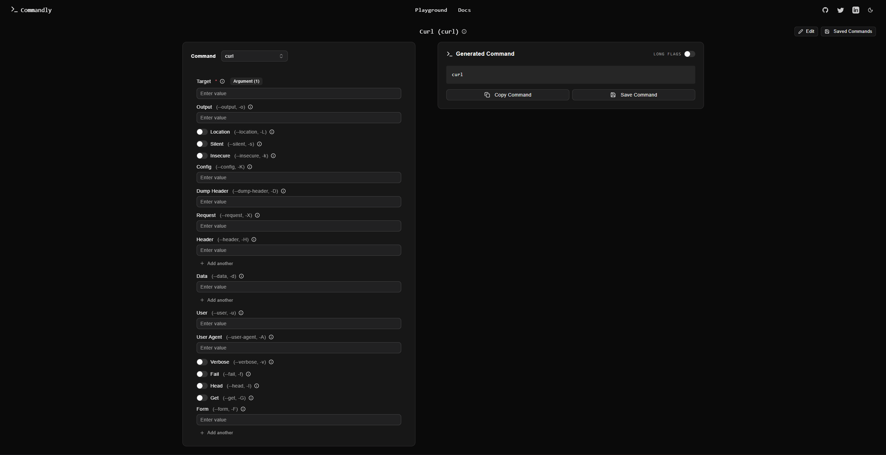

    <h1>Commandly</h1>
    

<h4 align="center">CLI -> JSON -> UI. Browse tool definitions, edit command schemas, and generate runnable CLI commands from a visual interface.</h4>
     

  <a href="#features">Features</a> •
  <a href="#contributing">Contribute</a> •
  <a href="https://buymeacoffee.com/divyeshio" target="_blank">Sponsor</a> •
  <a href="#license">License</a> •

## ✨ Features

<h1 align="center">
  
   
</h1>

- Commands and Subcommands
- Parameters
- Tool Renderer
- Specify Dependencies and Validations
- JSON Output - Nested, Flat.
- Generate Help Menu
- Generate Command
- Saved Commands
- Exclusion Groups
- JSON specification
- AI Generation - Quickly turn help text from any CLI tool into UI.

## Specification

- [Flat](https://commandly.divyeshio.in/docs/specification-schema)
- [Nested](https://commandly.divyeshio.in/docs/specification-nested)

## 🎯 Motivation

Complex CLI tools with tons of commands and options can be overwhelming. Commandly gives those tools a visual layer so you can browse them, edit them, and generate the exact command you need without memorizing every flag.

LLMs work best with structured data. Commandly keeps CLI definitions in a structured JSON format that is easy to inspect, validate, contribute, and reuse.

The same structure also makes the project useful for MCP and agent workflows, where tools need a reliable schema instead of loose help text.

## 💪🏻 Contributing

Development - Please read the [contributing guide](/CONTRIBUTING.md).

For adding new tools:

1. Create or edit a tool in the browser
2. Copy the **Flat** JSON output
3. Raise a PR with the JSON file in `tools-collection`

## 📜 License

Licensed under the [MIT license](https://github.com/divyeshio/Commandly/blob/main/LICENSE.md).
